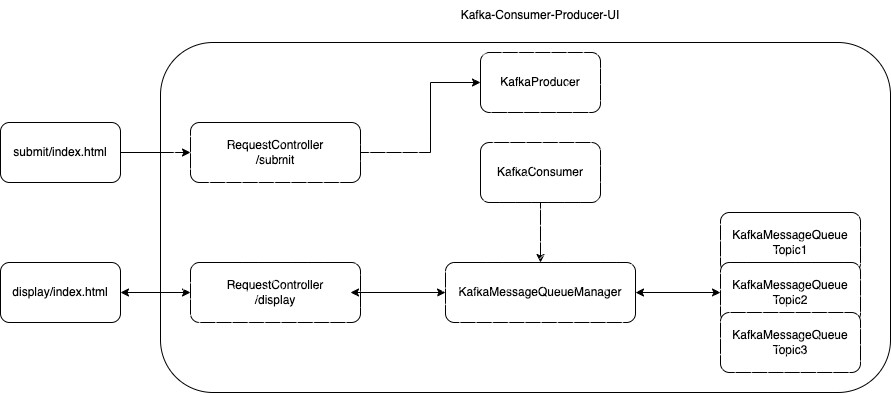

# Kafka Producer Consumer UI

I created this service and the two HTML files as part of hack week. The purpose of this service is to publish and consume 
kafka messages from a web-based UI. Currently, the service runs on port 8080, and consumes from `localhost:9092`. 

## How to use the service

Run the main service file `MaxMessagingServiceApplication`. Add the Kafka topics you want to publish to / consume from in `src/main/java/resources/application.properties`. 

### Publishing Messages

Open the file `html/submit/index.html` in your browser. Make sure the service is running. 
Publish messages to a topic via the UI. If the specified topic isn't in `application.properties`, the service will reject your publish and provide an alert. 

### Consuming Messages

Open the file `html/submit/index.html` in your browser. Make sure the service is running.
Enter a topic, and the number of messages you wish to consume. If the number of messages is greater than the amount of messages published, the service will 
reply to the UI with all the unconsumed messages. If the specified topic isn't in `application.properties`, the service will reject your publish and provide an alert. 

### How does it work?

